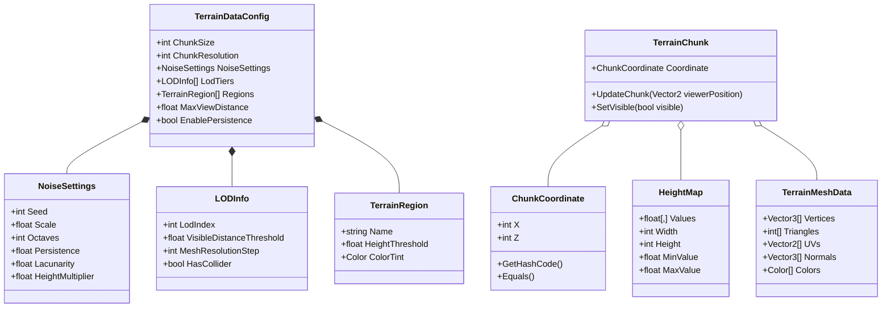

# Data Model: Procedural Terrain Generation via Perlin Noise

**Feature**: Procedural Terrain Generation via Perlin Noise (`001-terrain-generation`)  
**Status**: Complete  
**Date**: 2026-08-19

---

## 1. Domain Entities (Pure C#)

### 1.1 `NoiseSettings` (Struct / Class)
Configuration parameters for procedural noise sampling.

| Field | Type | Description | Validation / Constraints |
|---|---|---|---|
| `Seed` | `int` | Random numeric seed for permutation table. | Any integer. |
| `Scale` | `float` | Frequency scale of the noise. | Must be $> 0.0001f$. Clamped to minimum $0.001f$. |
| `Octaves` | `int` | Number of fractal detail layers (fBm). | Integer between $1$ and $8$. |
| `Persistence` | `float` | Amplitude multiplier per octave (roughness). | Value between $0.0f$ and $1.0f$. |
| `Lacunarity` | `float` | Frequency multiplier per octave. | Must be $\ge 1.0f$. Typically $2.0f$. |
| `HeightMultiplier` | `float` | Global vertical elevation amplitude scaling. | Must be $\ge 0.0f$. |
| `Offset` | `Vector2` (or `(float X, float Y)`) | Spatial offset vector for coordinate translation. | Valid finite floats. |

---

### 1.2 `ChunkCoordinate` (Readonly Struct)
Identifies a spatial chunk in 2D discrete grid space.

| Field | Type | Description | Validation / Constraints |
|---|---|---|---|
| `X` | `int` | Grid X coordinate of the chunk. | Integer index. |
| `Z` | `int` | Grid Z coordinate of the chunk. | Integer index. |

**Methods & Invariants**:
- Implements `IEquatable<ChunkCoordinate>`.
- Deterministic hash code generation for $O(1)$ dictionary lookups.
- `WorldPosition(float chunkSize)`: Returns the world-space center or origin coordinate.

---

### 1.3 `HeightMap` (Class)
Represents a 2D matrix of sampled and normalized elevation values.

| Field | Type | Description | Validation / Constraints |
|---|---|---|---|
| `Values` | `float[,]` | 2D matrix of elevation values. | Non-null, dimensions equal $(Width \times Height)$. |
| `Width` | `int` | Width of the grid (number of vertices). | $> 1$. |
| `Height` | `int` | Height / depth of the grid (number of vertices). | $> 1$. |
| `MinValue` | `float` | Minimum sampled elevation in this map. | Finite float $\le MaxValue$. |
| `MaxValue` | `float` | Maximum sampled elevation in this map. | Finite float $\ge MinValue$. |

---

### 1.4 `TerrainMeshData` (Class)
Holds computed raw geometry buffers before GPU/Unity upload.

| Field | Type | Description | Validation / Constraints |
|---|---|---|---|
| `Vertices` | `Vector3[]` | Array of 3D vertex positions. | Length corresponds to $(Width \times Height)$. |
| `Triangles` | `int[]` | Triangle index buffer. | Length is a multiple of 3. |
| `UVs` | `Vector2[]` | Texture/UV coordinate mapping array. | Same length as `Vertices`. |
| `Normals` | `Vector3[]` | Pre-calculated or recalculated surface normal vectors. | Same length as `Vertices`. |
| `Colors` | `Color[]` | Optional vertex color array (elevation region tints). | Same length as `Vertices` if used. |

---

### 1.5 `LODInfo` (Struct)
Defines resolution reduction rules for distance-based Level of Detail tiers.

| Field | Type | Description | Validation / Constraints |
|---|---|---|---|
| `LodIndex` | `int` | LOD level index ($0$ = highest detail, $1..3$ = simplified). | $\ge 0$. |
| `VisibleDistanceThreshold` | `float` | Maximum distance from viewer to render this LOD. | $> 0.0f$. Ascending order across LOD tiers. |
| `MeshResolutionStep` | `int` | Vertex skip step factor ($1, 2, 4, 6, 8$). | Must evenly divide chunk grid size. |
| `HasCollider` | `bool` | Whether physics `MeshCollider` is generated/enabled. | Typically `true` only for LOD 0. |

---

### 1.6 `BiomeRegion` / `TerrainRegion` (Struct / Class)
Defines an individual elevation layer / biome color and threshold.

| Field | Type | Description | Validation / Constraints |
|---|---|---|---|
| `Name` | `string` | Display name (e.g., "Deep Water", "Grass", "Snow"). | Non-empty string. |
| `HeightThreshold` | `float` | Normalized height boundary ($0.0f \dots 1.0f$). | Value in range $[0.0, 1.0]$. |
| `ColorTint` | `Color` | Color applied to this elevation region. | Valid RGBA color. |

---

## 2. Unity ScriptableObject & Presentation Layer

### 2.1 `TerrainDataConfig` (`ScriptableObject`)
The serialized preset container for designers.

```csharp
[CreateAssetMenu(fileName = "TerrainConfig", menuName = "Terrain/Configuration Preset")]
public class TerrainDataConfig : ScriptableObject
{
    [Header("Chunk Dimensions")]
    [Tooltip("Size of each chunk in world units (must divide evenly by LOD steps).")]
    public int ChunkSize = 240;

    [Tooltip("Number of vertices per edge for a chunk.")]
    [Range(16, 240)]
    public int ChunkResolution = 120;

    [Header("Noise Configuration")]
    public NoiseSettings NoiseSettings;

    [Header("LOD Settings")]
    [Tooltip("List of LOD levels with distance thresholds and resolution steps.")]
    public LODInfo[] LodTiers;

    [Header("Viewer & Streaming")]
    [Tooltip("Maximum view distance radius in world units.")]
    [Range(100f, 2000f)]
    public float MaxViewDistance = 600f;

    [Header("Biome / Elevation Regions")]
    [Tooltip("List of elevation regions sorted by height threshold.")]
    public TerrainRegion[] Regions;

    [Header("Persistence")]
    [Tooltip("Enable caching and persistence of visited chunk data.")]
    public bool EnablePersistence = true;
}
```

---

## 3. Relationships & Lifecycle Diagram


