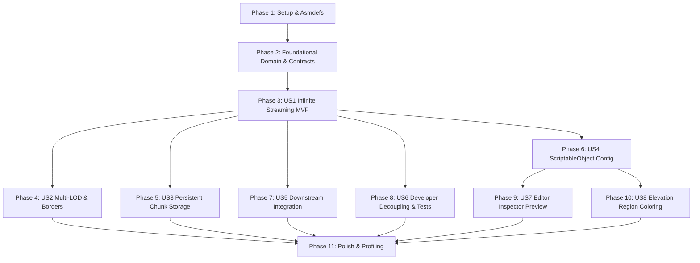

# Tasks: Procedural Terrain Generation via Perlin Noise

**Feature**: Procedural Terrain Generation via Perlin Noise (`001-terrain-generation`)  
**Status**: Complete (100% Implemented & Validated)  
**Spec**: [spec.md](spec.md) | **Plan**: [plan.md](plan.md)

---

## Phase 1: Setup (Shared Infrastructure & Assemblies)

**Purpose**: Initialize directory structure and Unity Assembly Definitions for clean architectural isolation.

- [X] T001 Create terrain directory structure per implementation plan in `ProjectTwoUnity/Assets/Scripts/Terrain/`
- [X] T002 [P] Create pure C# domain assembly definition `ProjectTwoUnity/Assets/Scripts/Terrain/Core/ProjectTwo.Terrain.Core.asmdef`
- [X] T003 [P] Create runtime presentation assembly definition `ProjectTwoUnity/Assets/Scripts/Terrain/Presentation/ProjectTwo.Terrain.Runtime.asmdef`
- [X] T004 [P] Create editor assembly definition `ProjectTwoUnity/Assets/Scripts/Terrain/Editor/ProjectTwo.Terrain.Editor.asmdef`
- [X] T005 [P] Create test assembly definition `ProjectTwoUnity/Assets/Scripts/Terrain/Tests/ProjectTwo.Terrain.Tests.asmdef`

---

## Phase 2: Foundational (Core Domain Models & Contracts)

**Purpose**: Core data structures and interface contracts that MUST be complete before user stories can be implemented.

- [X] T006 [P] Create contract `INoiseGenerator` in `ProjectTwoUnity/Assets/Scripts/Terrain/Core/Contracts/INoiseGenerator.cs`
- [X] T007 [P] Create contract `IChunkStorage` in `ProjectTwoUnity/Assets/Scripts/Terrain/Core/Contracts/IChunkStorage.cs`
- [X] T008 [P] Create contract `ITerrainProvider` in `ProjectTwoUnity/Assets/Scripts/Terrain/Core/Contracts/ITerrainProvider.cs`
- [X] T009 [P] Implement `NoiseSettings` model in `ProjectTwoUnity/Assets/Scripts/Terrain/Core/Models/NoiseSettings.cs`
- [X] T010 [P] Implement `ChunkCoordinate` struct in `ProjectTwoUnity/Assets/Scripts/Terrain/Core/Models/ChunkCoordinate.cs`
- [X] T011 [P] Implement `HeightMap` data structure in `ProjectTwoUnity/Assets/Scripts/Terrain/Core/Models/HeightMap.cs`
- [X] T012 [P] Implement `TerrainMeshData` model in `ProjectTwoUnity/Assets/Scripts/Terrain/Core/Models/TerrainMeshData.cs`
- [X] T013 [P] Implement `LODInfo` struct in `ProjectTwoUnity/Assets/Scripts/Terrain/Core/Models/LODInfo.cs`
- [X] T014 [P] Implement `TerrainRegion` model in `ProjectTwoUnity/Assets/Scripts/Terrain/Core/Models/TerrainRegion.cs`

**Checkpoint**: Foundation ready — domain models and contracts compiled and ready for user story implementation.

---

## Phase 3: User Story 1 - Infinite Procedural Landscape & Asynchronous Chunk Streaming (Priority: P1) 🎯 MVP

**Goal**: Deliver deterministic procedural terrain generation with asynchronous background calculation, viewer distance tracking, and chunk object pooling.

**Independent Test**: Supply a seed and view distance to `TerrainGenerator`, move viewer across chunk boundaries, and verify that chunks spawn ahead on background threads and pool upon exit without frame drops (60+ FPS).

### Tests for User Story 1 🧪
- [X] T015 [P] [US1] Unit test for Perlin noise determinism and bounds in `ProjectTwoUnity/Assets/Scripts/Terrain/Tests/EditMode/PerlinNoiseGeneratorTests.cs`
- [X] T016 [P] [US1] Unit test for 2D heightmap generation in `ProjectTwoUnity/Assets/Scripts/Terrain/Tests/EditMode/HeightMapBuilderTests.cs`

### Implementation for User Story 1
- [X] T017 [US1] Implement pure C# deterministic `PerlinNoiseGenerator` in `ProjectTwoUnity/Assets/Scripts/Terrain/Core/Services/PerlinNoiseGenerator.cs`
- [X] T018 [US1] Implement multi-octave `HeightMapBuilder` in `ProjectTwoUnity/Assets/Scripts/Terrain/Core/Services/HeightMapBuilder.cs`
- [X] T019 [US1] Implement `TerrainChunkView` component managing GameObject mesh/collider lifecycle in `ProjectTwoUnity/Assets/Scripts/Terrain/Presentation/Components/TerrainChunkView.cs`
- [X] T020 [US1] Implement `ChunkObjectPool` for zero-allocation recycling in `ProjectTwoUnity/Assets/Scripts/Terrain/Presentation/Pooling/ChunkObjectPool.cs`
- [X] T021 [US1] Implement `TerrainGenerator` async streaming controller in `ProjectTwoUnity/Assets/Scripts/Terrain/Presentation/Components/TerrainGenerator.cs`

**Checkpoint**: User Story 1 complete (MVP). Infinite terrain streams asynchronously around viewer without main thread blocking.

---

## Phase 4: User Story 2 - Distance-Based Multi-Level of Detail (LOD) & Seamless Borders (Priority: P2)

**Goal**: Generate multi-resolution mesh LODs based on viewer distance with seamless edge stitching and disabled distant colliders.

**Independent Test**: Position camera at varying distances from chunks and verify that mesh vertex count reduces per LOD tier while adjacent chunk edges remain perfectly sealed without cracks.

### Tests for User Story 2 🧪
- [X] T022 [P] [US2] Unit test for LOD vertex reduction and seamless edge alignment in `ProjectTwoUnity/Assets/Scripts/Terrain/Tests/EditMode/TerrainMeshBuilderTests.cs`

### Implementation for User Story 2
- [X] T023 [US2] Implement pure C# `TerrainMeshBuilder` with multi-LOD triangulation and edge normal stitching in `ProjectTwoUnity/Assets/Scripts/Terrain/Core/Services/TerrainMeshBuilder.cs`
- [X] T024 [US2] Integrate dynamic LOD distance switching and conditional collider enablement in `ProjectTwoUnity/Assets/Scripts/Terrain/Presentation/Components/TerrainChunkView.cs`

**Checkpoint**: User Stories 1 and 2 functional. Infinite world streams with Multi-LOD performance optimization.

---

## Phase 5: User Story 3 - Persistent Chunk State & Cache Storage (Priority: P3)

**Goal**: Cache generated/visited chunk heightmaps for instant retrieval (< 10ms) when backtracking, preventing redundant noise recalculation.

**Independent Test**: Travel to distant coordinates, return to starting chunk, and verify chunk reloads instantly from cache without recomputing noise.

### Tests for User Story 3 🧪
- [X] T025 [P] [US3] Unit test for chunk cache storage and retrieval in `ProjectTwoUnity/Assets/Scripts/Terrain/Tests/EditMode/ChunkStorageTests.cs`

### Implementation for User Story 3
- [X] T026 [US3] Implement `MemoryChunkStorage` in `ProjectTwoUnity/Assets/Scripts/Terrain/Core/Services/MemoryChunkStorage.cs`
- [X] T027 [US3] Integrate chunk caching and loading in `ProjectTwoUnity/Assets/Scripts/Terrain/Presentation/Components/TerrainGenerator.cs`

**Checkpoint**: Chunk persistence and caching active. Returning to visited terrain restores state in $< 10\text{ ms}$.

---

## Phase 6: User Story 4 - Modular Configuration Assets & Biome Management (Priority: P4)

**Goal**: Decouple all terrain generation parameters, noise settings, LOD tiers, and biome lists into a reusable `ScriptableObject` preset asset with rich tooltips and range validation.

**Independent Test**: Create two distinct `TerrainDataConfig` assets, swap them on `TerrainGenerator`, and verify the landscape reconfigures instantly to the new preset.

### Implementation for User Story 4
- [X] T028 [P] [US4] Implement `TerrainDataConfig` ScriptableObject in `ProjectTwoUnity/Assets/Scripts/Terrain/Presentation/Config/TerrainDataConfig.cs`
- [X] T029 [US4] Add parameter range clamping, validation, and tooltips across all serialized fields in `ProjectTwoUnity/Assets/Scripts/Terrain/Presentation/Config/TerrainDataConfig.cs`
- [X] T030 [US4] Hook configuration preset loading and live swapping in `ProjectTwoUnity/Assets/Scripts/Terrain/Presentation/Components/TerrainGenerator.cs`

**Checkpoint**: Designers can create, duplicate, and swap full terrain configuration presets without writing code.

---

## Phase 7: User Story 5 - Downstream Module Integration & Spatial Surface Queries (Priority: P5)

**Goal**: Expose decoupled spatial query methods (`GetHeight`, `GetNormal`, `GetSlope`, `GetBiomeAt`) with bilinear interpolation and lifecycle events (`OnChunkLoaded`, `OnTerrainGenerated`).

**Independent Test**: Run mock downstream spawner script querying elevation and slope across 100 arbitrary coordinates, verifying $< 0.01\text{ ms}$ query latency and accurate surface positioning.

### Tests for User Story 5 🧪
- [X] T031 [P] [US5] Integration test for `ITerrainProvider` queries and lifecycle events in `ProjectTwoUnity/Assets/Scripts/Terrain/Tests/PlayMode/TerrainProviderIntegrationTests.cs`

### Implementation for User Story 5
- [X] T032 [US5] Implement `ITerrainProvider` interface methods in `ProjectTwoUnity/Assets/Scripts/Terrain/Presentation/Components/TerrainGenerator.cs`
- [X] T033 [US5] Implement bilinear interpolation for continuous coordinate elevation and slope queries in `ProjectTwoUnity/Assets/Scripts/Terrain/Presentation/Components/TerrainGenerator.cs`
- [X] T034 [US5] Dispatch `OnChunkLoaded`, `OnChunkUnloaded`, and `OnTerrainRegenerated` events with context payload in `ProjectTwoUnity/Assets/Scripts/Terrain/Presentation/Components/TerrainGenerator.cs`

**Checkpoint**: Downstream modules (decor, vegetation, buildings, bridges) can cleanly query surface data and subscribe to chunk events.

---

## Phase 8: User Story 6 - Developer Ergonomics, Modularity & Test Automation (Priority: P6)

**Goal**: Ensure complete architectural decoupling of the pure C# domain from `UnityEngine` and validate $\ge 80\%$ automated unit test branch coverage.

**Independent Test**: Execute all core domain unit tests headlessly via Unity Test Runner / NUnit in $< 2$ seconds.

### Implementation for User Story 6
- [X] T035 [US6] Audit and verify zero `UnityEngine.Object` or `MonoBehaviour` references inside `ProjectTwoUnity/Assets/Scripts/Terrain/Core/`
- [X] T036 [US6] Ensure test suites in `ProjectTwoUnity/Assets/Scripts/Terrain/Tests/EditMode/` achieve $\ge 80\%$ branch coverage on domain services

---

## Phase 9: User Story 7 - Interactive & Dynamic Editor Preview (Priority: P7)

**Goal**: Provide custom Unity Editor Inspector with an on-demand "Generate Preview" button and "Auto Update" live toggle for real-time visual tweaking.

**Independent Test**: Modify noise sliders in Edit mode with Auto Update enabled, verifying the Scene view terrain regenerates smoothly in real time.

### Implementation for User Story 7
- [X] T037 [P] [US7] Implement `TerrainGeneratorEditor` with "Generate Preview" and "Auto Update" in `ProjectTwoUnity/Assets/Scripts/Terrain/Editor/TerrainGeneratorEditor.cs`
- [X] T038 [P] [US7] Implement `TerrainDataConfigEditor` with reorderable biome list and color pickers in `ProjectTwoUnity/Assets/Scripts/Terrain/Editor/TerrainDataConfigEditor.cs`

**Checkpoint**: Full Editor preview workflow functional. Designers can preview and tweak terrain live in Edit mode.

---

## Phase 10: User Story 8 - Elevation Region & Biome Visual Coloring (Priority: P8)

**Goal**: Apply visual biome/region coloring (water, sand, grass, rock, snow) to generated terrain meshes based on configured elevation thresholds.

**Independent Test**: Configure 5 distinct elevation regions with colors and verify that generated terrain mesh displays corresponding color bands across heights.

### Implementation for User Story 8
- [X] T039 [US8] Implement procedural elevation-to-color mapping in `ProjectTwoUnity/Assets/Scripts/Terrain/Core/Services/TerrainMeshBuilder.cs`
- [X] T040 [US8] Bind vertex color / texture material shader properties in `ProjectTwoUnity/Assets/Scripts/Terrain/Presentation/Components/TerrainChunkView.cs`

---

## Phase 11: Polish & Cross-Cutting Concerns

**Purpose**: End-to-end validation, performance profiling, and documentation consistency.

- [X] T041 Run quickstart validation guide in `specs/001-terrain-generation/quickstart.md` across EditMode and PlayMode
- [X] T042 Profile memory allocations during continuous chunk streaming to verify 0 steady-state GC allocations
- [X] T043 Verify frame rate stability ($\ge 60\text{ FPS}$, $< 2\text{ ms}$ main thread upload) using Unity Profiler

---

## Dependencies & Execution Order

