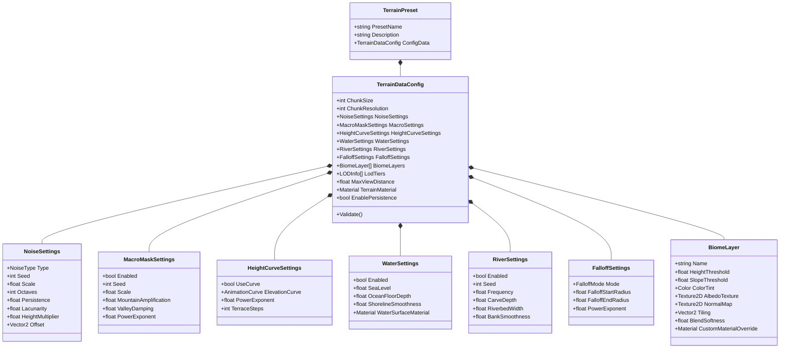

# Data Model & Schema Design: TerrainConfig Interface & Generation Expansion

**Feature Branch**: `002-terrain-config-ui-expansion`  
**Date**: 2026-08-20  
**Spec**: [spec.md](spec.md)

---

## 1. Entity Relationship Diagram



---

## 2. Core Entities & Value Models

### 2.1 `NoiseSettings` (Struct)
```csharp
public enum NoiseType
{
    PerlinFbm = 0,
    RidgedMultifractal = 1,
    Billow = 2
}

[Serializable]
public struct NoiseSettings : IEquatable<NoiseSettings>
{
    public NoiseType Type;
    public int Seed;
    public float Scale;
    public int Octaves;
    public float Persistence;
    public float Lacunarity;
    public float HeightMultiplier;
    public Vector2 Offset;
}
```

### 2.2 `MacroMaskSettings` (Struct)
```csharp
[Serializable]
public struct MacroMaskSettings : IEquatable<MacroMaskSettings>
{
    public bool Enabled;
    public int Seed;
    public float Scale;
    public float MountainAmplification; // e.g. 1.0 - 4.0
    public float ValleyDamping;          // e.g. 0.1 - 1.0
    public float PowerExponent;         // non-linear scaling of macro regions
}
```

### 2.3 `WaterSettings` & `RiverSettings` (Structs)
```csharp
[Serializable]
public struct WaterSettings : IEquatable<WaterSettings>
{
    public bool Enabled;
    public float SeaLevel;
    public float OceanFloorDepth;
    public float ShorelineSmoothness;
    public Material WaterSurfaceMaterial;
}

[Serializable]
public struct RiverSettings : IEquatable<RiverSettings>
{
    public bool Enabled;
    public int Seed;
    public float Frequency;
    public float CarveDepth;
    public float RiverbedWidth;
    public float BankSmoothness;
}
```

### 2.4 `FalloffSettings` & `HeightCurveSettings` (Structs / Classes)
```csharp
public enum FalloffMode
{
    None = 0,
    Circular = 1,
    Square = 2
}

[Serializable]
public struct FalloffSettings : IEquatable<FalloffSettings>
{
    public FalloffMode Mode;
    public float FalloffStartRadius;
    public float FalloffEndRadius;
    public float PowerExponent;
}

[Serializable]
public class HeightCurveSettings
{
    public bool UseCurve;
    public AnimationCurve ElevationCurve;
    public float PowerExponent;
    public int TerraceSteps;
}
```

### 2.5 `BiomeLayer` (Class)
```csharp
[Serializable]
public class BiomeLayer
{
    public string Name;
    [Range(0f, 1f)]
    public float HeightThreshold;
    [Range(0f, 90f)]
    public float SlopeThreshold; // Degrees for cliff/rock transitions
    public Color ColorTint;
    public Texture2D AlbedoTexture;
    public Texture2D NormalMap;
    public Vector2 Tiling;
    [Range(0.01f, 1f)]
    public float BlendSoftness;
    public Material CustomMaterialOverride;
}
```

---

## 3. Validation Invariants

1. **Chunk Resolution & Size**: Must remain divisible by 12 ($\text{ChunkResolution} \pmod{12} == 0, \text{ChunkSize} \pmod{12} == 0$) with min 24 to guarantee seamless LOD stitchings.
2. **Noise Parameters**: Scale $> 0.001$, Octaves $\in [1..8]$, Persistence $\in [0.01..1.0]$, Lacunarity $\ge 1.0$.
3. **Biome Ordering**: Biome height thresholds must remain monotonically ordered ($h_0 \le h_1 \le \dots \le h_n \le 1.0$).
4. **Water Level Bounds**: $\text{SeaLevel} \ge 0$, $\text{CarveDepth} \ge 0$.
