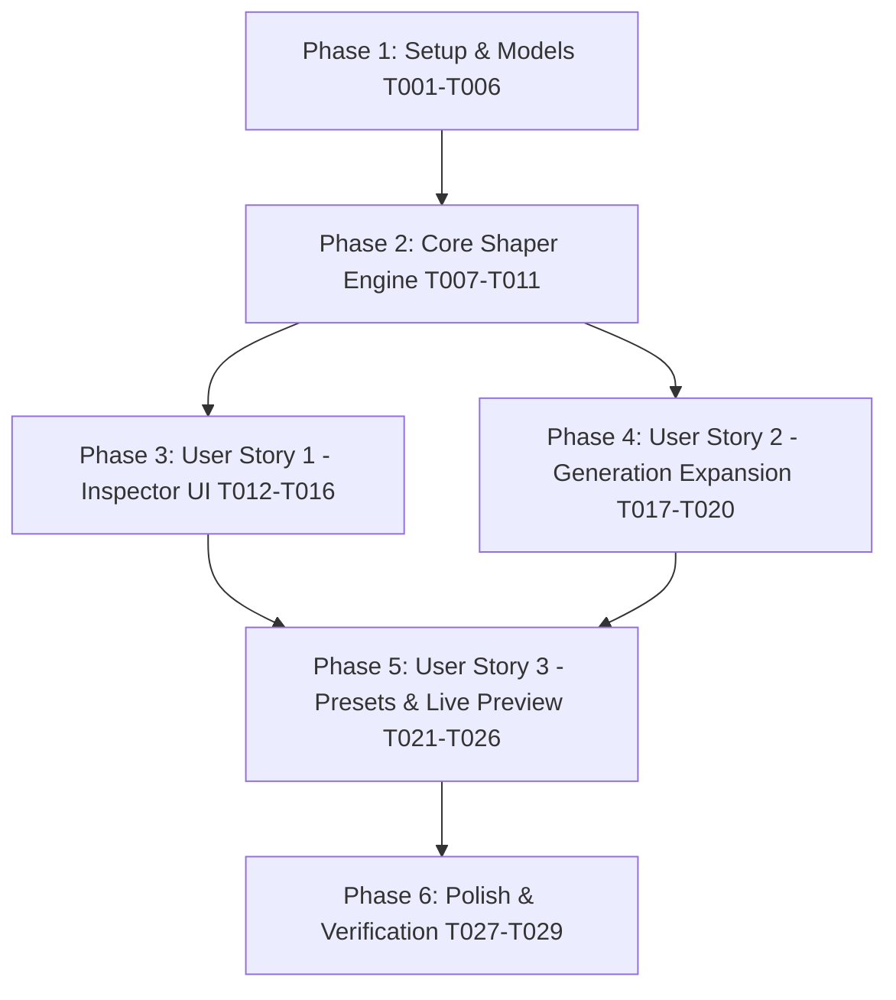

# Tasks: TerrainConfig Interface & Generation Capabilities Expansion

**Feature Branch**: `002-terrain-config-ui-expansion`  
**Date**: 2026-08-20  
**Spec**: [spec.md](spec.md) | **Plan**: [plan.md](plan.md)

---

## Phase 1: Setup & Data Model Foundation

**Purpose**: Establish domain data structures, contracts, and core enum types across the solution.

- [x] T001 [P] Define `NoiseType` and update `NoiseSettings` struct in `ProjectTwoUnity/Assets/Scripts/Terrain/Core/Models/NoiseSettings.cs`
- [x] T002 [P] Create `MacroMaskSettings` model in `ProjectTwoUnity/Assets/Scripts/Terrain/Core/Models/MacroMaskSettings.cs`
- [x] T003 [P] Create `WaterSettings` and `RiverSettings` models in `ProjectTwoUnity/Assets/Scripts/Terrain/Core/Models/WaterSettings.cs` and `ProjectTwoUnity/Assets/Scripts/Terrain/Core/Models/RiverSettings.cs`
- [x] T004 [P] Create `FalloffSettings` and `HeightCurveSettings` models in `ProjectTwoUnity/Assets/Scripts/Terrain/Core/Models/FalloffSettings.cs` and `ProjectTwoUnity/Assets/Scripts/Terrain/Core/Models/HeightCurveSettings.cs`
- [x] T005 [P] Create `TerrainPreset` ScriptableObject model in `ProjectTwoUnity/Assets/Scripts/Terrain/Core/Models/TerrainPreset.cs`
- [x] T006 [P] Update `TerrainRegion` / `BiomeLayer` with texture slots, UV tiling, slope threshold in `ProjectTwoUnity/Assets/Scripts/Terrain/Core/Models/TerrainRegion.cs`

---

## Phase 2: Foundational (Core Abstractions & Shaper Engine)

**Purpose**: Core mathematical services that block procedural generation and inspector integration.

- [x] T007 Define `ITerrainShaper` domain interface in `ProjectTwoUnity/Assets/Scripts/Terrain/Core/Contracts/ITerrainShaper.cs`
- [x] T008 [P] Implement `ProceduralTerrainShaper` with Ridged, Billow, Perlin fBm, and Macro Continent Masking in `ProjectTwoUnity/Assets/Scripts/Terrain/Core/Services/ProceduralTerrainShaper.cs`
- [x] T009 Implement River Carving, Sea Level depth clamping, and Falloff calculations in `ProjectTwoUnity/Assets/Scripts/Terrain/Core/Services/ProceduralTerrainShaper.cs`
- [x] T010 Update `HeightMapBuilder` to execute via `ITerrainShaper` in `ProjectTwoUnity/Assets/Scripts/Terrain/Core/Services/HeightMapBuilder.cs`
- [x] T011 [P] Create unit tests for `ProceduralTerrainShaper` in `ProjectTwoUnity/Assets/Scripts/Terrain/Tests/EditMode/ProceduralTerrainShaperTests.cs`

**Checkpoint**: Foundation ready - pure C# shaper tests pass cleanly without Unity scene dependencies.

---

## Phase 3: User Story 1 - Intuitive & Visual Inspector UI (Priority: P1) 🌟 MVP

**Goal**: Deliver a clean, categorized, and ergonomic Inspector UI for `TerrainDataConfig` with seamless LOD snapping and biome height gradient visualizer.

**Independent Test**: Open `TerrainConfig.asset` in Unity Inspector; verify collapsible foldouts, adjust Chunk Resolution to verify auto-snapping to multiples of 12 with info box, and edit biomes to observe live color/height gradient bar.

### Implementation for User Story 1

- [x] T012 [US1] Update `TerrainDataConfig` ScriptableObject to hold all modular shaper settings and validation rules in `ProjectTwoUnity/Assets/Scripts/Terrain/Presentation/Config/TerrainDataConfig.cs`
- [x] T013 [US1] Implement categorized foldout sections (Grid, Macro, Noise, Water, Biomes, LOD, Presets) in `ProjectTwoUnity/Assets/Scripts/Terrain/Editor/TerrainDataConfigEditor.cs`
- [x] T014 [US1] Implement seamless grid multiple-of-12 validation badges and smart snapping sliders in `ProjectTwoUnity/Assets/Scripts/Terrain/Editor/TerrainDataConfigEditor.cs`
- [x] T015 [US1] Implement interactive biome layer list with height gradient visualizer, slope sliders, and texture preview slots in `ProjectTwoUnity/Assets/Scripts/Terrain/Editor/TerrainDataConfigEditor.cs`
- [x] T016 [P] [US1] Create unit tests for config validation and multiple-of-12 snapping in `ProjectTwoUnity/Assets/Scripts/Terrain/Tests/EditMode/TerrainConfigValidationTests.cs`

**Checkpoint**: User Story 1 complete and independently testable in the Unity Editor.

---

## Phase 4: User Story 2 - Expanded Generation Features & Noise Topographies (Priority: P2)

**Goal**: Enable designers to generate varied terrain archetypes (sharp mountain peaks, rolling hills, rivers, island falloff, and plateau terraces) deterministically.

**Independent Test**: Change Noise Type to `RidgedMultifractal`, enable `Macro Mountain Mask`, enable `Procedural River Carving`, and verify distinct topography formations in scene rendering and heightmap calculations.

### Implementation for User Story 2

- [x] T017 [US2] Implement non-linear elevation curve and power remapping evaluation in `ProjectTwoUnity/Assets/Scripts/Terrain/Core/Services/ProceduralTerrainShaper.cs`
- [x] T018 [US2] Implement boundary falloff masking (Circular and Square) in `ProjectTwoUnity/Assets/Scripts/Terrain/Core/Services/ProceduralTerrainShaper.cs`
- [x] T019 [US2] Implement quick utility actions (Randomize Seed, Reset Defaults) in `ProjectTwoUnity/Assets/Scripts/Terrain/Editor/TerrainDataConfigEditor.cs`
- [x] T020 [P] [US2] Add unit tests for river carving, sea level floor, and falloff masks in `ProjectTwoUnity/Assets/Scripts/Terrain/Tests/EditMode/ProceduralTerrainShaperTests.cs`

**Checkpoint**: User Stories 1 and 2 functional and verified.

---

## Phase 5: User Story 3 - Preset Management & Direct 3D Live Scene Preview (Priority: P3)

**Goal**: Provide 1-click built-in/custom preset management and smooth live 3D Scene View preview with `CancellationTokenSource` task cancellation and draft-mode LOD switching.

**Independent Test**: Select `Alpine Mountains` or `Archipelago` from the preset library, click Apply, and verify instant scene terrain transformation. Rapidly drag noise sliders to verify draft low-res generation during motion without UI freezing or memory leaks.

### Implementation for User Story 3

- [x] T021 [US3] Create built-in archetype preset assets (`AlpineMountains`, `RollingPlains`, `Archipelago`, `DesertCanyons`) in `ProjectTwoUnity/Assets/Presets/Terrain/`
- [x] T022 [US3] Implement preset selector, loader, and exporter GUI in `ProjectTwoUnity/Assets/Scripts/Terrain/Editor/TerrainDataConfigEditor.cs`
- [x] T023 [US3] Integrate `CancellationTokenSource` task cancellation and debounced scheduling (120ms) for background generation in `ProjectTwoUnity/Assets/Scripts/Terrain/Presentation/Components/TerrainGenerator.cs`
- [x] T024 [US3] Implement progressive preview pipeline (draft LOD 4 during active dragging, full LOD on release) in `ProjectTwoUnity/Assets/Scripts/Terrain/Presentation/Components/TerrainGenerator.cs`
- [x] T025 [US3] Enforce explicit `DestroyImmediate` cleanup of superseded preview meshes in Edit mode in `ProjectTwoUnity/Assets/Scripts/Terrain/Presentation/Components/TerrainGenerator.cs`
- [x] T026 [P] [US3] Add unit tests for preset serialization and applying in `ProjectTwoUnity/Assets/Scripts/Terrain/Tests/EditMode/TerrainPresetTests.cs`

**Checkpoint**: All three user stories complete and fully functional.

---

## Phase 6: Polish & Cross-Cutting Quality Gates

**Purpose**: System integration, shader material updates, and end-to-end verification.

- [x] T027 Update default terrain shader / material to support slope-based cliff rock texturing in `ProjectTwoUnity/Assets/Scripts/Terrain/Presentation/Shaders/TerrainTriplanar.shader`
- [x] T028 Run full test suite in Unity Test Runner and verify 100% pass rate in `ProjectTwo.Terrain.Tests`
- [x] T029 Execute all validation scenarios from `specs/002-terrain-config-ui-expansion/quickstart.md`

---

## Dependencies & Execution Order

### Parallel Execution Opportunities
- **Phase 1**: Models T001, T002, T003, T004, T005, T006 can all be authored in parallel.
- **Phase 2**: Tests T011 can be created in parallel with shaper implementations.
- **Phase 3 & 4**: Can be developed concurrently once Phase 2 foundation is complete.

---

## Implementation Strategy

### MVP Delivery (User Story 1 Only)
1. Complete Phase 1 & Phase 2.
2. Complete Phase 3 (User Story 1).
3. Designers have an immediate, ergonomic, and validated UI for existing and core parameters.

### Incremental Feature Expansion
1. Add Phase 4 for advanced topographies (Ridged, Rivers, Falloff, Curves).
2. Add Phase 5 for Presets, Draft-Mode Live Updates, and Cancellation Token safety.
3. Polish shaders and run full validation.
