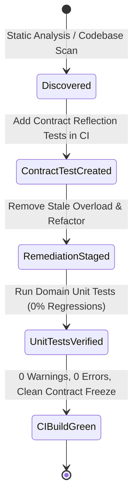

# Data Model & Architectural Schema: SOLID Audit, Clean Pipeline & Contract Testing

## 1. Domain Entities & Audit Schema

### `AuditFinding`
Represents an architectural or dead-code issue detected during codebase review.

| Field | Type | Description |
|---|---|---|
| `Id` | `string` | Unique identifier (e.g., `FINDING-001`) |
| `Category` | `AuditCategory` | `SOLID_SRP`, `SOLID_DIP`, `SOLID_ISP`, `CONSTITUTION_PIPELINE`, `PHANTOM_CODE` |
| `Severity` | `AuditSeverity` | `Critical`, `Major`, `Minor` |
| `TargetFile` | `string` | Relative path to source file |
| `SymbolName` | `string` | Class, interface, or method identifier |
| `Description` | `string` | Detailed rationale and violation description |
| `RemediationAction` | `string` | Concrete refactoring or removal step |
| `Status` | `FindingStatus` | `Open`, `Resolved`, `Verified` |

---

### `ContractValidationRule`
Represents an automated assertion evaluated by the Contract Reflection Test Suite.

| Field | Type | Description |
|---|---|---|
| `RuleId` | `string` | e.g. `RULE_NO_STALE_OVERLOADS` |
| `TargetAssembly` | `string` | `ProjectTwo.Terrain.Core` |
| `TargetContract` | `string` | `ITerrainShaper`, `ITerrainProvider`, etc. |
| `RequiredParameters` | `string[]` | List of mandatory parameter types for calculation pipelines |
| `DisallowedSignatures` | `string[]` | Signatures known to bypass active pipeline layers |

---

## 2. Canonical Pipeline & Parameter Propagation

### Authoritative Calculation Pipeline (`ITerrainShaper`)
All elevation calculations in the system must route through the single authoritative pipeline with full contextual parameters:

```text
World Coordinates (X, Z)
   ├── NoiseSettings (Multi-type Base Noise)
   ├── MacroMaskSettings (Continental / Mountain Masking)
   ├── TectonicSettings + TectonicBoundary[] (Plate Uplifts & Rifts)
   ├── HeightCurveSettings (Non-linear Elevation & Terracing)
   ├── WaterSettings (Sea Level Clamping & Basins)
   ├── RiverSettings (Legacy / Parametric Rivers)
   ├── HydrologySettings + RiverGraph (Vector River Network Carving)
   └── FalloffSettings (Boundary Island Falloff)
   ==> Final World Elevation
```

---

## 3. Verified State Transitions


