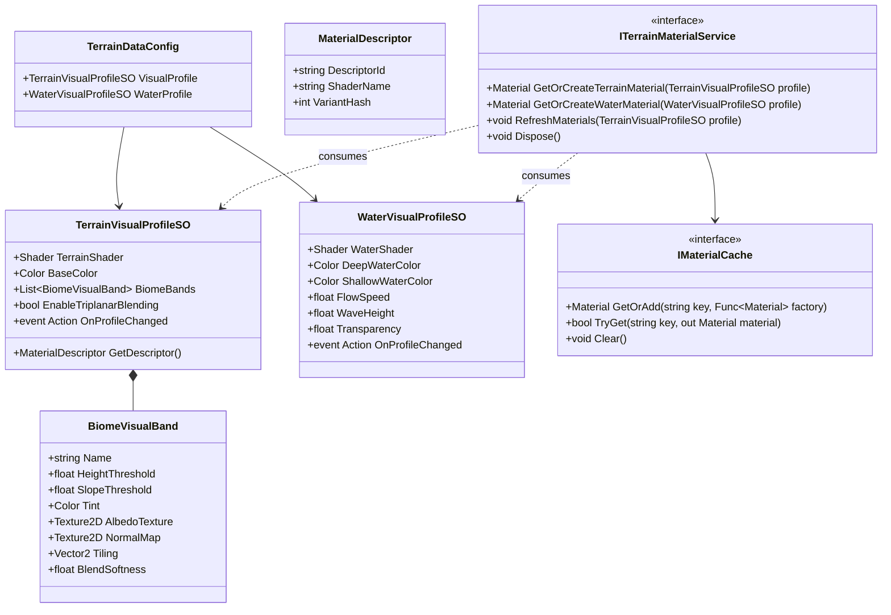

# Data Model: Terrain Material Generation Module

**Feature**: `005-terrain-material-generation`
**Date**: 2026-08-21
**Status**: Completed

## 1. Entity Overview & Architecture

---

## 2. Model Specifications

### 2.1 `TerrainVisualProfileSO` (ScriptableObject)
- **Assembly**: `ProjectTwo.Terrain.Runtime`
- **Fields**:
  - `Shader TerrainShader`: Base shader to use (defaults to `TerrainVertexColor.shader`).
  - `Color BaseTint`: Global tint color.
  - `BiomeVisualBand[] BiomeBands`: Ordered collection of elevation and slope bands.
  - `bool EnableTriplanar`: Flag enabling texture array or triplanar shader features.
  - `Material FallbackMaterial`: Safe fallback in case shader compilation fails.
- **Events**:
  - `Action OnProfileChanged`: Fired on inspector `OnValidate()` or runtime parameter updates.

### 2.2 `BiomeVisualBand` (Serializable Struct)
- **Fields**:
  - `string Name`: Layer identifier (e.g., "Deep Water", "Green Grass", "Snowy Peaks").
  - `float HeightThreshold`: Normalized elevation cutoff (0.0 to 1.0).
  - `float SlopeThreshold`: Cliff/slope cutoff in degrees (0 to 90).
  - `Color Tint`: Layer tint color.
  - `Texture2D AlbedoTexture`: Optional diffuse texture.
  - `Texture2D NormalMap`: Optional normal map.
  - `Vector2 Tiling`: UV scaling factor.
  - `float BlendSoftness`: Transition width between layers (0.01 to 1.0).

### 2.3 `WaterVisualProfileSO` (ScriptableObject)
- **Assembly**: `ProjectTwo.Terrain.Runtime`
- **Fields**:
  - `Shader WaterShader`: Base shader (defaults to `WaterSimple.shader`).
  - `Color DeepWaterColor`: Color for deep river/lake depths.
  - `Color ShallowWaterColor`: Color for shoreline/shallow water.
  - `float FlowSpeed`: Water surface animation speed.
  - `float WaveHeight`: Vertex displacement or normal wave strength.
  - `float Opacity`: Transparency coefficient.
- **Events**:
  - `Action OnProfileChanged`: Fired when water properties are adjusted.

### 2.4 `MaterialDescriptor` (Read-only Value Struct)
- **Assembly**: `ProjectTwo.Terrain.Core.Models`
- **Fields**:
  - `string DescriptorId`: Abstract unique key referencing the visual style.
  - `int VariantHash`: Hash code representing visual parameters for caching.

---

## 3. Lifecycle & Memory Rules
1. **Creation**: Materials are instantiated strictly via `ITerrainMaterialService` using registered factory methods.
2. **Caching**: Cached in memory by composite key: `{ProfileInstanceID}_{ShaderName}_{Variant}`.
3. **Disposal**: When terrain generator is disabled/destroyed or visual profile is unloaded, `ITerrainMaterialService.Dispose()` is invoked, calling `UnityEngine.Object.Destroy` (or `DestroyImmediate` in edit mode) on all owned runtime material instances.
