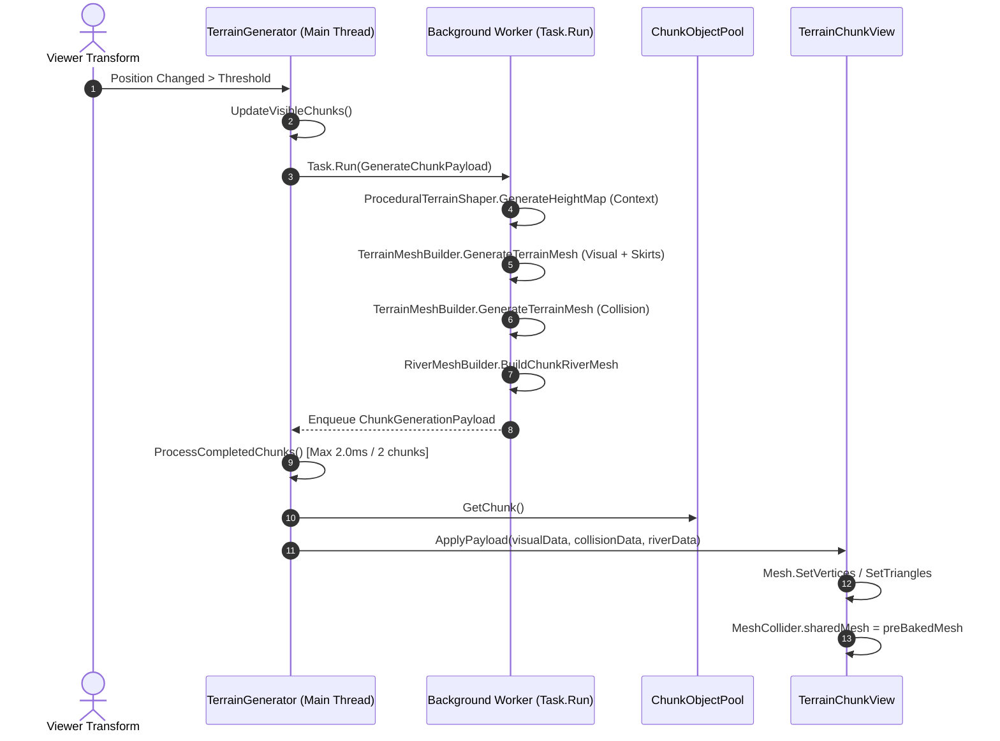

# Data Model & State Architecture: Asynchronous Multithreaded Pipeline

**Feature**: `007-async-multithreaded-pipeline-optimization`
**Date**: 2026-08-22

## 1. Domain Entities & Value Objects

### 1.1 `TerrainShaperContext` (Readonly Struct)
*Purpose*: Encapsulates the entire domain parameter suite for continuous mathematical elevation, heightmap evaluation, and river network carving.

```csharp
namespace ProjectTwo.Terrain.Core.Models
{
    public readonly struct TerrainShaperContext
    {
        public readonly NoiseSettings Noise;
        public readonly MacroMaskSettings Macro;
        public readonly TectonicSettings Tectonics;
        public readonly TectonicBoundary[] TectonicBoundaries;
        public readonly HeightCurveSettings HeightCurve;
        public readonly WaterSettings Water;
        public readonly RiverSettings River;
        public readonly HydrologySettings Hydrology;
        public readonly RiverGraph RiverGraph;
        public readonly FalloffSettings Falloff;

        public TerrainShaperContext(
            NoiseSettings noise,
            MacroMaskSettings macro,
            TectonicSettings tectonics,
            TectonicBoundary[] tectonicBoundaries,
            HeightCurveSettings heightCurve,
            WaterSettings water,
            RiverSettings river,
            HydrologySettings hydrology,
            RiverGraph riverGraph,
            FalloffSettings falloff)
        {
            Noise = noise;
            Macro = macro;
            Tectonics = tectonics;
            TectonicBoundaries = tectonicBoundaries;
            HeightCurve = heightCurve;
            Water = water;
            River = river;
            Hydrology = hydrology;
            RiverGraph = riverGraph ?? RiverGraph.Empty;
            Falloff = falloff;
        }

        public static TerrainShaperContext CreateDefault() =>
            new TerrainShaperContext(
                NoiseSettings.CreateDefault(),
                MacroMaskSettings.CreateDefault(),
                TectonicSettings.CreateDefault(),
                null,
                HeightCurveSettings.CreateDefault(),
                WaterSettings.CreateDefault(),
                RiverSettings.CreateDefault(),
                HydrologySettings.CreateDefault(),
                RiverGraph.Empty,
                FalloffSettings.CreateDefault());
    }
}
```

---

### 1.2 `ChunkGenerationPayload` (Transfer Struct)
*Purpose*: Complete background calculation payload ready for instantaneous Main Thread native mesh upload and activation.

```csharp
namespace ProjectTwo.Terrain.Presentation.Components
{
    using ProjectTwo.Terrain.Core.Models;

    public readonly struct ChunkGenerationPayload
    {
        public readonly ChunkCoordinate Coordinate;
        public readonly HeightMap HeightMap;
        public readonly TerrainMeshData VisualMeshData;
        public readonly TerrainMeshData CollisionMeshData;
        public readonly RiverWaterMeshData RiverMeshData;
        public readonly int TargetLOD;
        public readonly bool HasCollider;

        public ChunkGenerationPayload(
            ChunkCoordinate coordinate,
            HeightMap heightMap,
            TerrainMeshData visualMeshData,
            TerrainMeshData collisionMeshData,
            RiverWaterMeshData riverMeshData,
            int targetLOD,
            bool hasCollider)
        {
            Coordinate = coordinate;
            HeightMap = heightMap;
            VisualMeshData = visualMeshData;
            CollisionMeshData = collisionMeshData;
            RiverMeshData = riverMeshData;
            TargetLOD = targetLOD;
            HasCollider = hasCollider;
        }
    }
}
```

---

## 2. Component State Transitions & Data Flow


