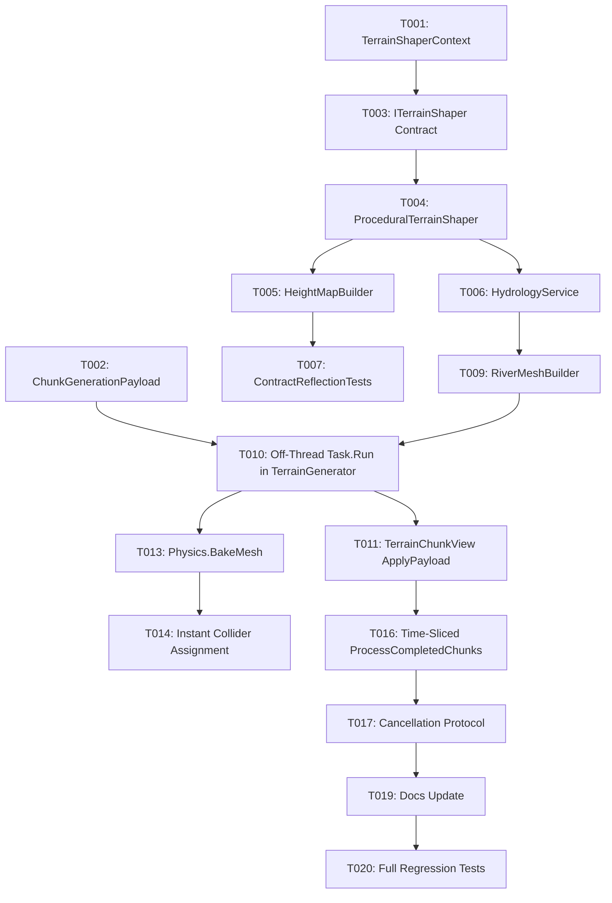

# Tasks: Asynchronous Multithreaded Pipeline & Streaming Optimization

**Input**: Design documents from [`/specs/007-async-multithreaded-pipeline-optimization/`](./)
**Prerequisites**: [plan.md](./plan.md), [spec.md](./spec.md), [research.md](./research.md), [data-model.md](./data-model.md), [contracts/](./contracts/)

## Format: `- [ ] [TaskID] [P?] [Story?] Description with file path`

- **[P]**: Can run in parallel (different files, no dependencies)
- **[Story]**: Which user story this task belongs to (`[US1]`, `[US2]`, `[US3]`, `[US4]`)

---

## Phase 1: Setup & Data Structures

**Purpose**: Define the core transfer payloads and context structures before modifying services.

- [X] T001 [P] Create `TerrainShaperContext.cs` readonly struct in `ProjectTwoUnity/Assets/Scripts/Terrain/Core/Models/TerrainShaperContext.cs`
- [X] T002 [P] Create `ChunkGenerationPayload.cs` transfer struct in `ProjectTwoUnity/Assets/Scripts/Terrain/Presentation/Components/ChunkGenerationPayload.cs`

---

## Phase 2: Foundational (Parameter Context Refactoring - US4)

**Purpose**: Eliminate the 12-15 parameter antipattern across all domain contracts and services.

- [X] T003 [P] [US4] Refactor `ITerrainShaper.cs` contract to consume `in TerrainShaperContext` in `ProjectTwoUnity/Assets/Scripts/Terrain/Core/Contracts/ITerrainShaper.cs`
- [X] T004 [US4] Refactor `ProceduralTerrainShaper.cs` to implement context-based evaluation in `ProjectTwoUnity/Assets/Scripts/Terrain/Core/Services/ProceduralTerrainShaper.cs`
- [X] T005 [P] [US4] Refactor `HeightMapBuilder.cs` to forward `in TerrainShaperContext` in `ProjectTwoUnity/Assets/Scripts/Terrain/Core/Services/HeightMapBuilder.cs`
- [X] T006 [US4] Update `HydrologyService.cs` elevation queries to use `TerrainShaperContext` in `ProjectTwoUnity/Assets/Scripts/Terrain/Core/Services/HydrologyService.cs`
- [X] T007 [P] [US4] Update `ContractReflectionTests.cs` to assert `TerrainShaperContext` on domain interfaces in `ProjectTwoUnity/Assets/Scripts/Terrain/Tests/EditMode/ContractReflectionTests.cs`
- [X] T008 [P] [US4] Update `ProceduralTerrainShaperTests.cs` and `HeightMapBuilderTests.cs` in `ProjectTwoUnity/Assets/Scripts/Terrain/Tests/EditMode/`

**Checkpoint**: Core domain interfaces are clean, cohesive, and pass 100% of reflection tests.

---

## Phase 3: User Story 2 - Off-Thread Visual & Hydrological Geometry Generation (Priority: P2)

**Goal**: Move 100% of mesh building (visual terrain, collision, and river water ribbon) into background worker threads.
**Independent Test**: Background generation returns a complete `ChunkGenerationPayload` with non-null visual, collision, and river meshes before Main Thread ingestion.

- [X] T009 [P] [US2] Update `RiverMeshBuilder.cs` to consume `TerrainShaperContext` in `ProjectTwoUnity/Assets/Scripts/Terrain/Core/Services/RiverMeshBuilder.cs`
- [X] T010 [US2] Update `TerrainGenerator.cs` `RequestChunkGeneration` to build visual mesh, collision mesh, and river mesh inside `Task.Run` in `ProjectTwoUnity/Assets/Scripts/Terrain/Presentation/Components/TerrainGenerator.cs`
- [X] T011 [US2] Refactor `TerrainChunkView.cs` to provide `ApplyPayload` for direct native buffer upload in `ProjectTwoUnity/Assets/Scripts/Terrain/Presentation/Components/TerrainChunkView.cs`
- [X] T012 [P] [US2] Update `DomainDecouplingTests.cs` in `ProjectTwoUnity/Assets/Scripts/Terrain/Tests/EditMode/DomainDecouplingTests.cs` to verify off-thread mesh generation

**Checkpoint**: Main thread zero-geometry load achieved; meshes built entirely in background.

---

## Phase 4: User Story 3 - Asynchronous Physics Collision Mesh Baking (Priority: P3)

**Goal**: Pre-bake PhysX collision BVH trees off-thread to eliminate the 10ms cooking hitch when assigning `MeshCollider.sharedMesh`.
**Independent Test**: Verify collision mesh assignment on the Main Thread takes $<0.2\text{ms}$.

- [X] T013 [US3] Integrate `Physics.BakeMesh` inside background worker task for LOD 0 chunks in `ProjectTwoUnity/Assets/Scripts/Terrain/Presentation/Components/TerrainGenerator.cs`
- [X] T014 [US3] Update `TerrainChunkView.cs` collision assignment to consume pre-baked mesh in `ProjectTwoUnity/Assets/Scripts/Terrain/Presentation/Components/TerrainChunkView.cs`
- [X] T015 [P] [US3] Add unit test validating collision mesh baking off-thread in `ProjectTwoUnity/Assets/Scripts/Terrain/Tests/EditMode/DomainModelTests.cs`

**Checkpoint**: PhysX cooking hitches eliminated during chunk spawning.

---

## Phase 5: User Story 1 - Zero-Hitch Chunk Streaming & Time-Sliced Frame Activation (Priority: P1) 🎯 MVP

**Goal**: Enforce $\le 2.0\text{ms}$ or max 2 chunks per frame ingestion limit on the Main Thread.
**Independent Test**: Spawning 36 chunks simultaneously produces stable 60+ FPS with frame processing time $\le 2.0\text{ms}$.

- [X] T016 [US1] Implement hybrid time-slicing budget loop (`Stopwatch` $\le 2.0\text{ms}$ / max 2 chunks) in `TerrainGenerator.ProcessCompletedChunks` in `ProjectTwoUnity/Assets/Scripts/Terrain/Presentation/Components/TerrainGenerator.cs`
- [X] T017 [US1] Add robust cancellation and queue draining on camera teleport or world regeneration in `TerrainGenerator.cs`
- [X] T018 [P] [US1] Add integration test for time-sliced activation in `ProjectTwoUnity/Assets/Scripts/Terrain/Tests/EditMode/DomainModelTests.cs`

**Checkpoint**: 60+ FPS maintained during heavy chunk streaming without frame drops.

---

## Phase 6: Polish & Cross-Cutting Concerns

**Purpose**: Documentation and full regression test suite verification.

- [X] T019 [P] Update `docs/troubleshooting-knowledge-base.md` documenting the async pipeline, `Physics.BakeMesh`, and time-slicing optimizations
- [X] T020 Run full test suite across all assemblies (`ProjectTwo.Terrain.Tests`) to ensure 100% pass rate

---

## Dependencies & Execution Order

---

## Implementation Strategy

### Incremental Delivery & Validation
1. **Step 1 (Foundational - US4)**: Refactor domain parameter contexts and pass all reflection tests.
2. **Step 2 (Off-Thread Geometry - US2)**: Build all vertex/triangle buffers in background workers.
3. **Step 3 (Physics - US3)**: Pre-cook collision mesh off-thread with `Physics.BakeMesh`.
4. **Step 4 (Time-Slicing - US1)**: Enforce the $\le 2.0\text{ms}$ / max 2 chunks frame budget for smooth 60+ FPS.
5. **Step 5 (Verification)**: Run all EditMode/Integration test suites.
